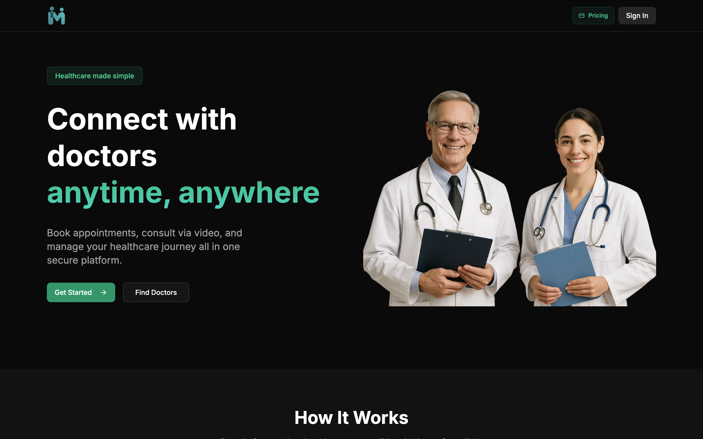

# 🏥 Doctors Appointment Platform

**Full-Stack Doctors Appointment Platform with Video Call** – A modern web app built using **Next.js**, **React 19**, **Tailwind CSS**, **Shadcn UI**, **Prisma**, **NeonDB**, **Clerk Authentication**, and **Vonage Video API**.

This project is perfect for your resume—it demonstrates authentication, database management, subscription plans, real-time video calls, admin & doctor dashboards, and much more.

<p align="center">
  
  
  <a href="LICENSE">
    
  </a>
</p>

---

<p align="center">
  <a href="https://doctors-appointment-platform-one.vercel.app/">🌐 Live Demo</a> •
  <a href="https://github.com/Dharmendra-07/Doctors-Appointment-Platform">📦 GitHub Repo</a>
</p>

**Dashboard Snapshot:**



## 🎯 Features

* **User Features**

  * User authentication with **Clerk**
  * Browse doctors by specialty
  * Book appointments and manage slots
  * Video call with doctors using **Vonage**
  * Add notes and cancel appointments

* **Doctor Features**

  * Doctor onboarding and profile setup
  * Set availability slots
  * Manage appointment requests
  * Access video calls with patients

* **Admin Features**

  * View all users, doctors, and appointments
  * Manage doctor approvals and subscriptions
  * Admin dashboard with analytics

* **Other Features**

  * Subscription plans for users
  * Fully responsive UI with **Shadcn UI** & **Tailwind CSS**
  * PostgreSQL DB hosted on **NeonDB** with **Prisma ORM**

---

## 🛠️ Tech Stack

| Frontend     | Backend            | Database            | Authentication     | Video API        |
| ------------ | ------------------ | ------------------- | ------------------ | ---------------- |
| Next.js      | Next.js API Routes | NeonDB (PostgreSQL) | Clerk              | Vonage Video API |
| React 19     | Prisma ORM         | Prisma Models       | JWT                | Real-time video  |
| Tailwind CSS | Node.js            | Relational          | Session management |                  |

---

## 🚀 Getting Started

### Prerequisites

* Node.js >= 18
* npm or yarn
* PostgreSQL or NeonDB account
* Clerk account for authentication
* Vonage API key for video calls

### Installation

1. Clone the repo:

```bash
git clone https://github.com/<your-username>/doctors-appointment-platform.git
cd doctors-appointment-platform
```

2. Install dependencies:

```bash
npm install
# or
yarn install
```

3. Setup `.env` file:

```env
DATABASE_URL=<your_neon_db_url>
CLERK_FRONTEND_API=<your_clerk_frontend_api>
CLERK_API_KEY=<your_clerk_api_key>
VONAGE_API_KEY=<your_vonage_api_key>
VONAGE_API_SECRET=<your_vonage_api_secret>
```

4. Run Prisma migrations:

```bash
npx prisma migrate dev --name init
```

5. Start the development server:

```bash
npm run dev
# or
yarn dev
```

6. Open [http://localhost:3000](http://localhost:3000) to view the app.

---

## 📂 Project Structure

```
doctors-appointment-platform/
│
├─ /app                # Next.js pages & layouts
├─ /components         # UI Components (Shadcn UI)
├─ /prisma             # Prisma schema & migrations
├─ /lib                # API calls & helpers
├─ /assets             # Images & icons
├─ /styles             # Tailwind & global styles
└─ /pages/api          # Backend API routes
```

---

## 📝 Notes

* Real-time video calls use **Vonage Video API**.
* Authentication and sessions managed with **Clerk**.
* Database models and relationships handled with **Prisma ORM**.
* Responsive UI built entirely with **Tailwind CSS** and **Shadcn UI**.

## 💼 Author

📧 Contact: `dharmendrra06@gmail.com`

[Live Demo](https://doctors-appointment-platform-one.vercel.app/)
